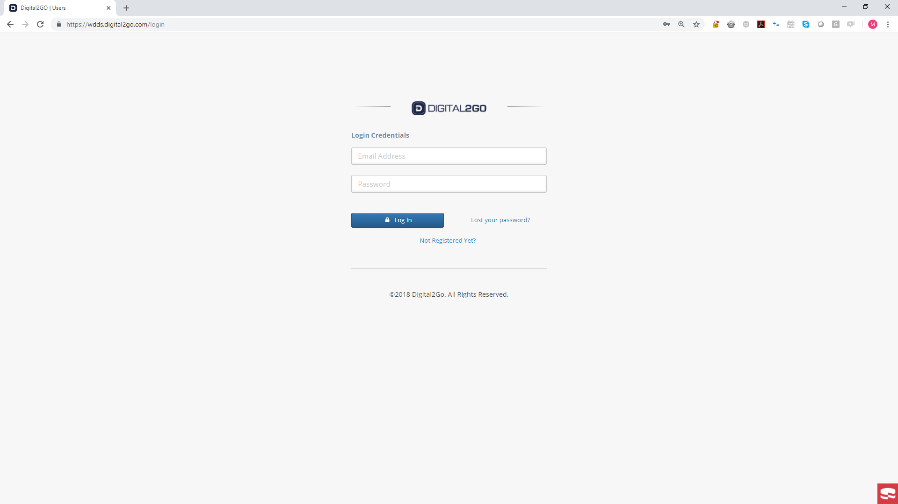
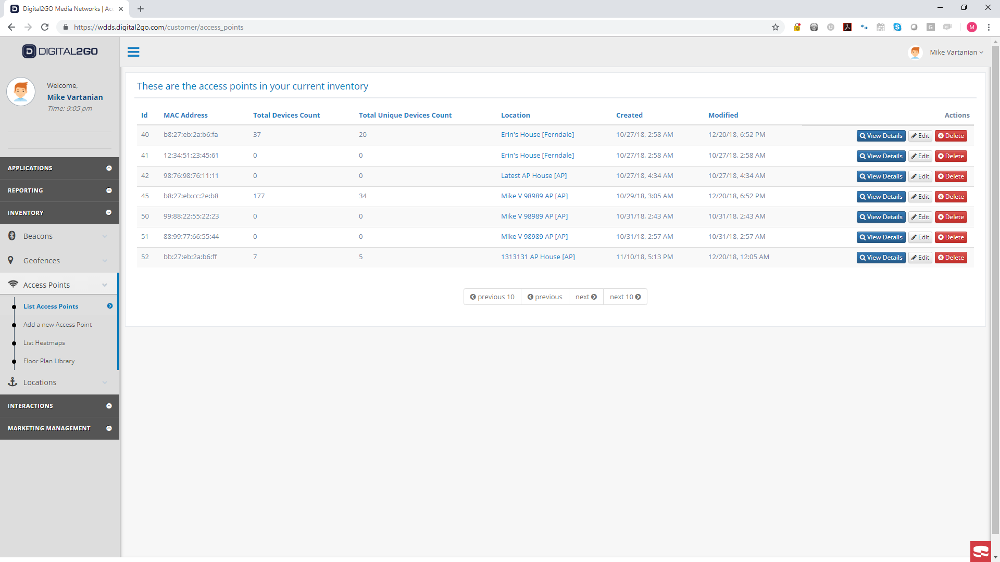
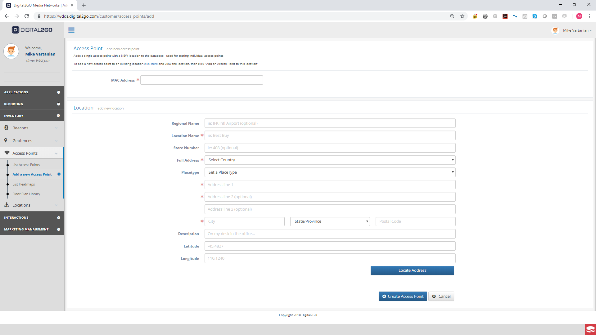
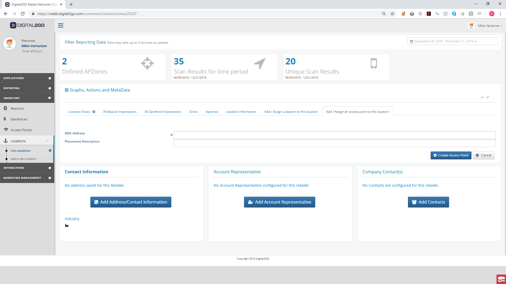
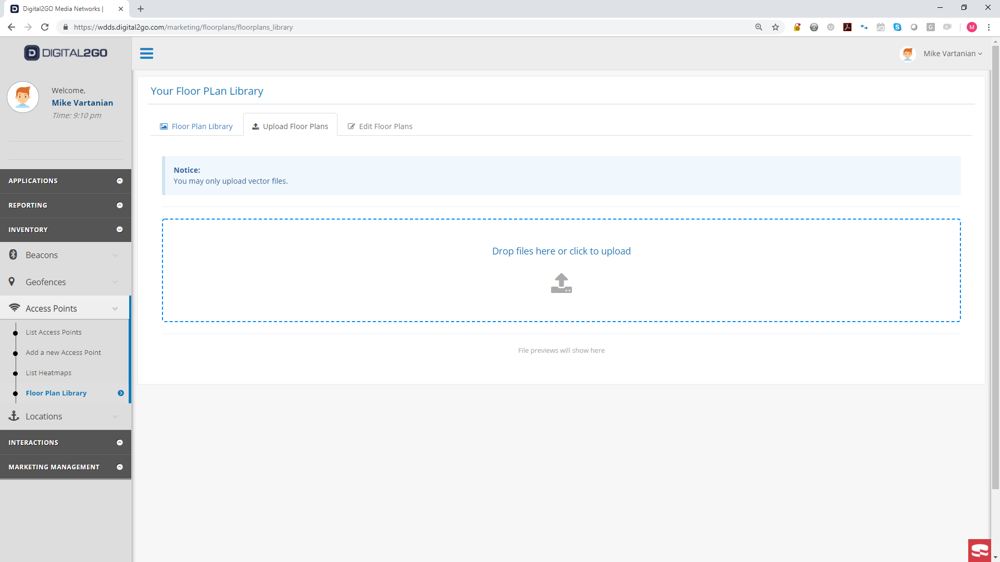
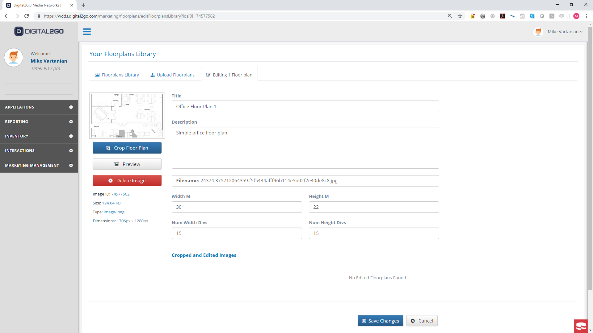

# WDDS Platform Documentation

The platform code is built as an add on to the existing platform built by [Locally.io](https://locally.io). As a result, the system cannot be completely built with just the code included in this GitHub Repository.

# Platform Description

The platform provides the following capabilities specific to WDDS:

* Login
* List Access Points
* Add Access Points
* Edit Access Point Details
  * MAC Address
  * Associated Floor plan
* Associate Access Points with Location
* Associate Floor plans with Access Points
* Upload Floor plans
* View Floor plans
* Edit Floor plans
 * Image Dimensions
 * Real World Dimensions
 * Number of Divisions (used for Trilateration approximation)
* View Total Scan Results
* View Total Unique Devices
* View Total Scan Results specific to an Access Point
* View Unique Devices specific to an Access Point
* Visualize summary data in a dashboard
* Visualize heatmap data over floor plan

## Login
The system utilizes a standard login authentication procedure with configurable password requirements.

## Access Points
Access Points, more specifically "emulated access points", are the embedded devices with the WiFi scanning code. Access Points are identified by an id and their MAC Address. The system provides the following features associated with Access Points.

### List Access Points
The system allows the user to list all the access points created in the user's customer account.

### Add Access Points
#### With New Location

#### To an Existing Location

### Edit Access Point Details
#### MAC Address
#### Associated Floor plan

## #Associate Access Points with Location

## Associate Floor plans with Access Points
## Upload Floor plans

## View Floor plans
## Edit Floor plans

### Image Dimensions
### Real World Dimensions
### Number of Divisions (used for Trilateration approximation)
## View Total Scan Results
## View Total Unique Devices
## View Total Scan Results specific to an Access Point
## View Unique Devices specific to an Access Point
## Visualize summary data in a dashboard
## Visualize heatmap data over floor plan
