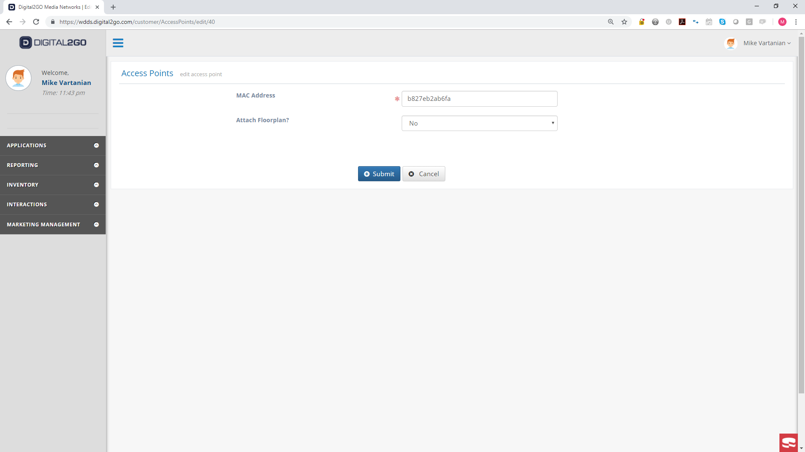
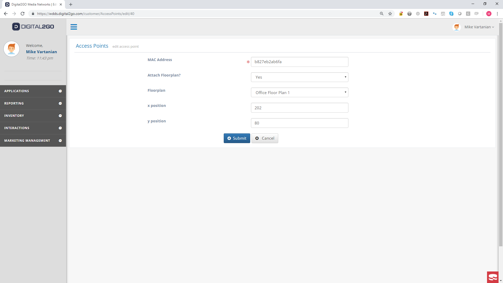
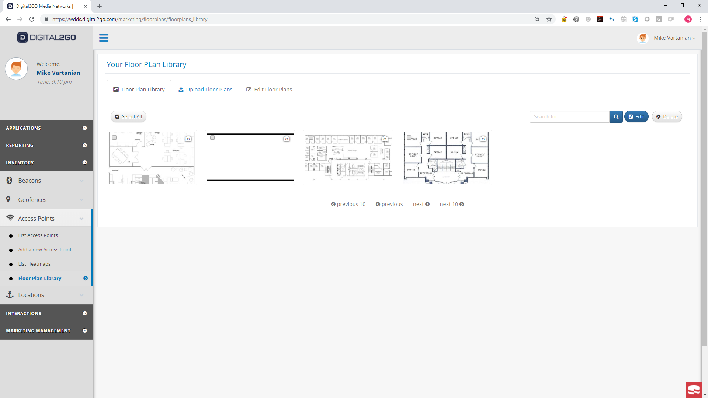
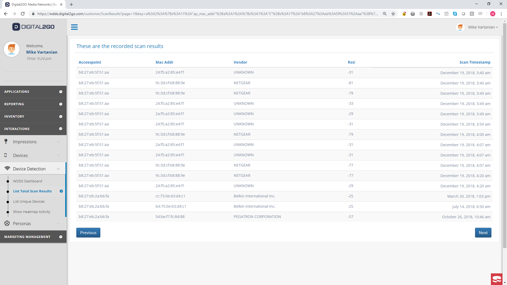
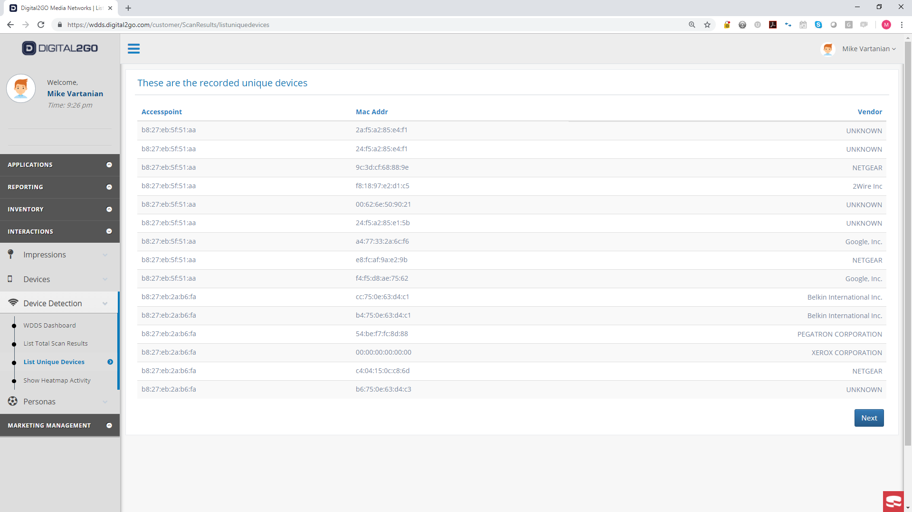
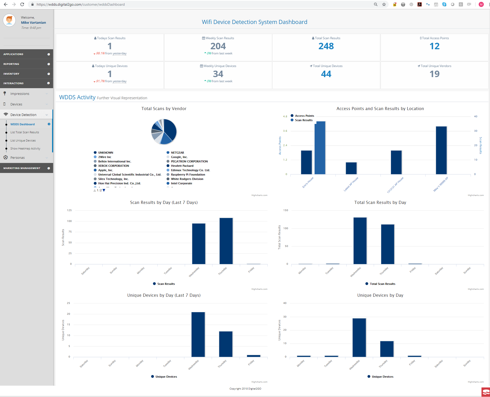

# WDDS Platform Documentation

The platform code is built as an add on to the existing platform built by [Locally.io](https://locally.io). As a result, the system cannot be completely built with just the code included in this GitHub Repository.

# Platform Description

The platform provides the following capabilities specific to WDDS:

* Login
* List Access Points
* Add Access Points
* Edit Access Point Details
  * MAC Address
  * Associated Floor plan
* Associate Access Points with Location
* Associate Floor plans with Access Points
* Upload Floor plans
* View Floor plans
* Edit Floor plans
 * Image Dimensions
 * Real World Dimensions
 * Number of Divisions (used for Trilateration approximation)
* View Total Scan Results
* View Total Unique Devices
* View Total Scan Results specific to an Access Point
* View Unique Devices specific to an Access Point
* Visualize summary data in a dashboard
* Visualize heatmap data over floor plan

## Login
The system utilizes a standard login authentication procedure with configurable password requirements.

## Access Points
Access Points, more specifically "emulated access points", are the embedded devices with the WiFi scanning code. Access Points are identified by an id and their MAC Address. The system provides the following features associated with Access Points.

### List Access Points
The system allows the user to list all the access points created in the user's customer account.

### Add Access Points
As the system needs to associate an access point with a location, the system allows the user to add access points to a new location or an existing location.

#### With New Location

#### To an Existing Location

### Edit Access Point Details
The system allows the user to edit the parameters of the access point after it has been created. The parameters that can be edited are:
1. MAC Address
2. Floor Plan Attached?
3. X,Y coordinates if Floor Plan Attached

If there is no floor plan attached, the system hides the floor plan specific parameters as shown below.

If there ia a floor plan attached, the system will display the floor plan specific parameters as shown below.

Attaching a floorplan will create a heatmap that associates the access points with floor plans.

## Floor Plans
Floor plans are graphical representations of the physical space. The floor plans give the system something to display the scan results data over to get better insight into device activity. The system provides the ability for the user to upload, view, and edit floor plans. The system currently accepts image based file formats (.jpg, .png, .gif, etc.) but eventually will include vector based file formats.

### Upload Floor plans
The user can drag and drop files or select them through a browser window to get the floor plans into the system. 

There is a programmable minimum width requirement for files.

## View Floor plans
## Edit Floor plans

The system allows the user to enter additional information about the floor plan as well as do some simple image manipulation.

### Real World Dimensions
The file sizes are measured in pixels but the RSSI measurements from the access points are based on real distance so the user will need to enter the physical dimensions.

### Number of Divisions (used for Trilateration approximation)

For the trilateration approximation, the user needs to enter the number of divisions. This divides the floor plan into a grid where we count the amount of energy observed in each coordinate.

## View Total Scan Results

## View Total Unique Devices

## View Total Scan Results specific to an Access Point

## Visualize summary data in a dashboard
The system provides a dashboard where the relevant data can be viewed.

## Visualize heatmap data over floor plan
