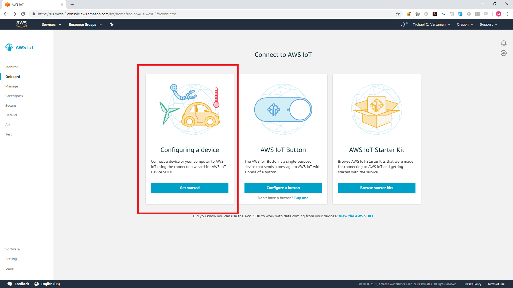
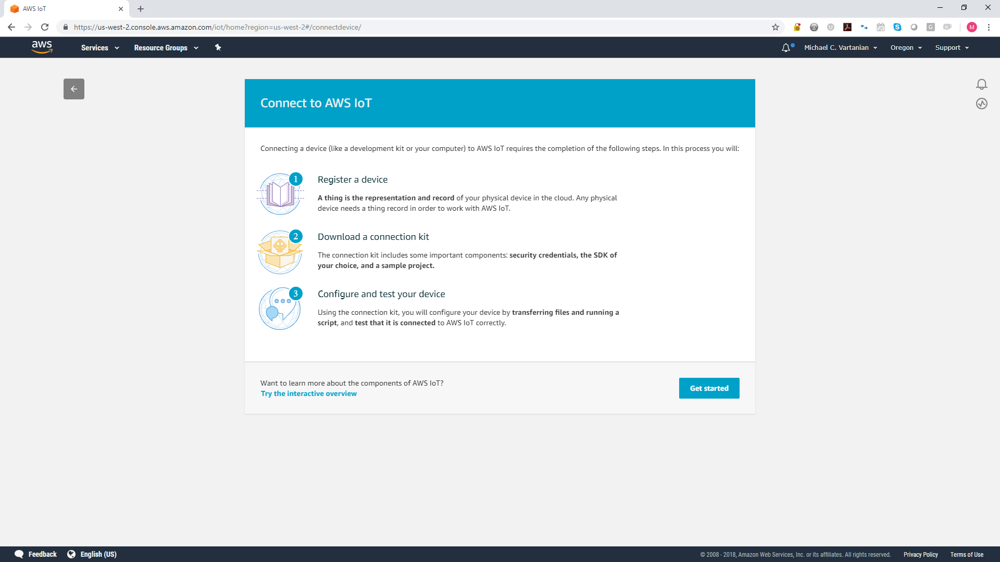
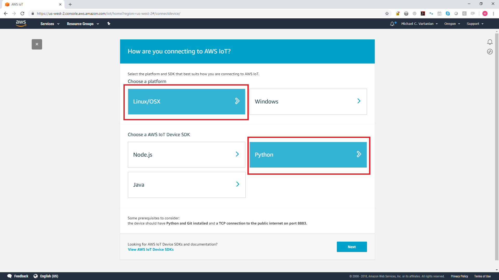
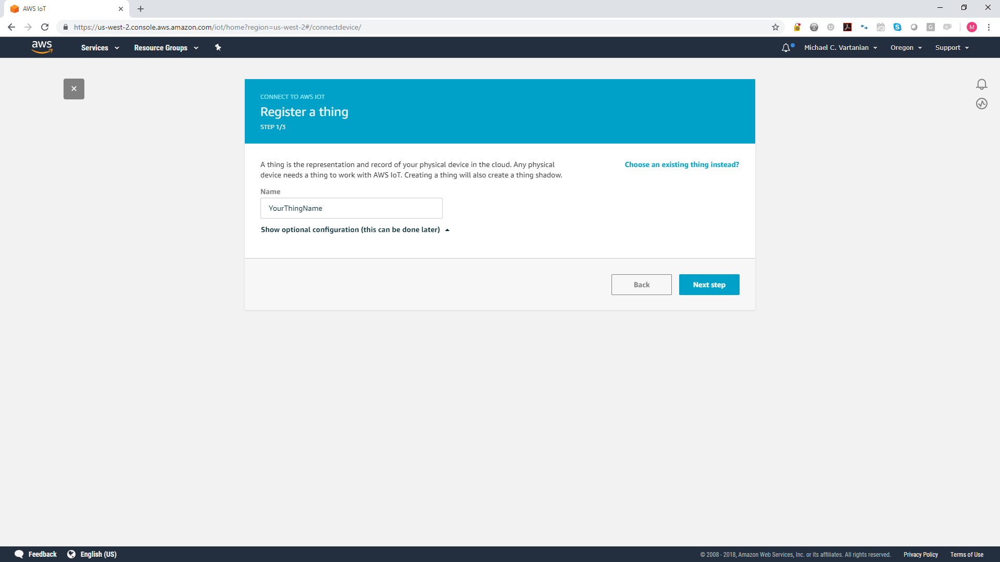
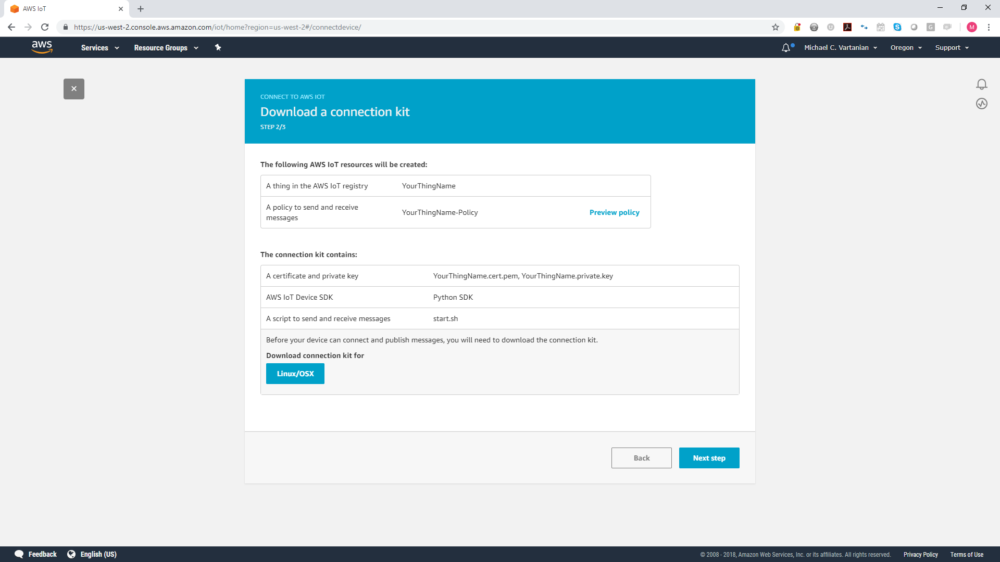
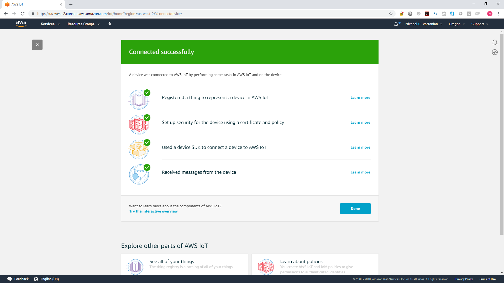

# Embedded Wifi Access Point Scanner Code
## Pre Install Requirements
In order to successfully run the WiFi Access Point Scanning Software, you will need the following:
- AWS Account (to use AWS IoT and DynamoDB)
- IoT Device Security Credentials (public/private keys/certificates). Can create from https://us-west-2.console.aws.amazon.com/iot/home?region=us-west-2#/connectdevice/

## Configure AWS IoT Setup
The WiFi Access Point Scanner Code communicates to the cloud using AWS IoT. For the Raspberry Pi to communicate with AWS IoT, we will need to include the AWS IoT Python SDK on the device. This will be taken care of using the included script file `start.sh`.

This section talks about what needs to happen within the AWS IoT Console to get the necessary credentials/keys configured.

### Configure IoT Device

Within the AWS IoT Platform, navigate to the Onboard section and select "Configuring a device"


### Register IoT Device




### Choose Connection to IoT Device

As mentioned previously, the WiFi Access Point Scanner Code is written in Python on a linux based Raspberry Pi. Therefore you will need to choose the following platform and SDK as shown below.



### Name the Device
After choosing how you will connect the device to the AWS IoT platform, name the device. This will associate the Raspberry Pi with a human readable name within the platform.



### Download the Connection Kit
Within the AWS IoT tool, they give you the option to download all the necessary files to run code that sends messages to/from the Python device. The following screenshot shows what selections need to be made to choose the Python SDK running on Linux.



Downloading the kit will provide the following files:
* start.sh
* YourThingName.cert.pem
* YourThingName.private.key
* YourThingName.public.key

Now this is almost what we need for the WiFi Access Point Scanning Software. The provided python file `aws_iot_pubsub.py` contains the generic code to access AWS IoT, sending/receiving MQTT messages. For the scanning software, we will need to utilize this shell but have the additional code that emulates an access point and scans for nearby WiFi devices.

### Confirm Success


## Installing Necessary Software
Please run the provided startup script `start.sh` to make sure that you have all the necessary libraries to run the scanner code.
1. Add your AWS IoT custom endpoint, Certificate, and private key in the designated spots in `start.sh`
2. Make sure that `start.sh` is executable
```sudo chmod +x start.sh```

## Run Scanner Code
The included startup script `wifi_start.sh` will make sure that you have all the necessary libraries and credentials to run the scanner code.
The script will do the following:
* Check to see if you downloaded the package manager contents
* Ensure there is no newline found at the end of the AWS `start.sh` file
* Extract the credentials from the AWS `start.sh` file
* Download the AWS root certificate
* Install the AWS IoT Python SDK
* Install netaddr
* Install scapy
* Ensure that Wi-Fi is in Monitor Mode
* Run the actual scanning code
