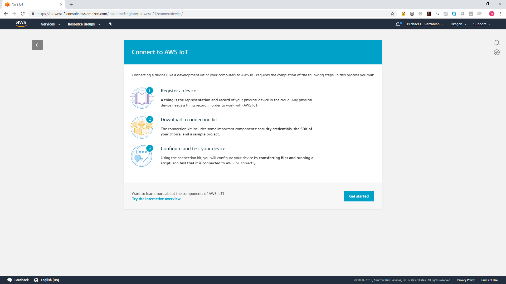

# dgmd-599-finalproject
Repository for presentation, code, and documentation for DGMD-599 Final Capstone Project
## Requirements
To be able to fully test the system, you will need the following:
*Raspberry Pi 3
*AWS Account with Credentials
*Platform Account (will be provided)
## Register IoT Device

